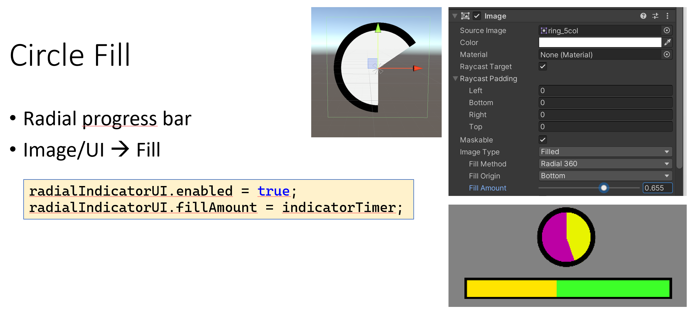
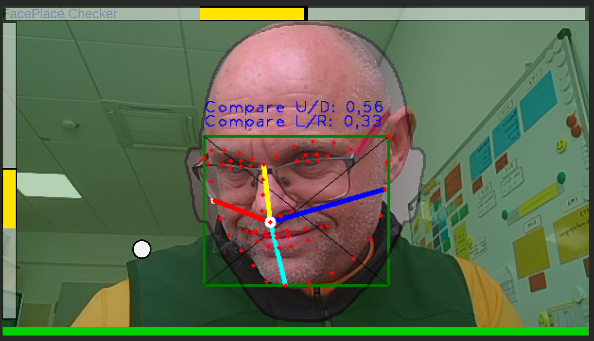

# Progressbar (linear, circular), ClockButton, Spirit Level Display, ...

ClockButton like Eyetoy (Unity Code)
Code similar to [this YouTube Video](https://www.youtube.com/watch?v=5xWDKJj1UGY) 

Wichtig: Image Type > **Filled**

Can be used for
* SpiritLevel Display (Wasserwaage)
* Info Meter
* Filling Clock
* Progress Bar
* Face Feedback: Neigung, Rotation, Position X/Y



## Usage

1. UI Image Element
2. Optional: Background image Element
3. Attach Code

Use **Time.deltaTime** for constant movement.

```
radialIndicatorUI.enabled = true;
radialIndicatorUI.fillAmount = indicatorTimer;
```

# Face Balken Feedback (Wasserwaage)




